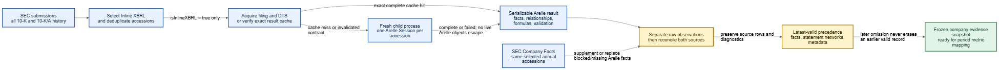

# MS2 — Annual Inline XBRL Ingestion and Evidence

## Status

`active`

This plan contains the ingestion and evidence portion of the approved former
Plan 203 design. The split from mapping is organizational only: MS2 and MS3
still execute as one atomic company-refresh workflow when fully integrated.

### Current implementation coverage

Implemented seams include complete annual submissions discovery, typed Arelle
evidence records, one-accession process isolation, sequential inventory
processing, exact-result caching, immutable fiscal-period industry labels,
source reconciliation, and latest-valid evidence precedence. They are not yet
fully wired into the public annual company workflow. `docs/structure.md`
describes the exact current runtime.

## Purpose and Deliverable

Process every selected Inline XBRL `10-K` and `10-K/A` for a company with
Arelle, preserve independent Arelle and SEC Company Facts observations, apply
fact- and evidence-specific precedence, and produce one complete traceable
company evidence snapshot for MS3.

Arelle is the canonical structural and validation processor. It does not assign
project metric names. MS2 ends at the immutable, precedence-resolved evidence
handoff; metric mapping and recovery belong to MS3.

## Diagram



Editable sources: [Mermaid](../diagrams/MS2-ingestion.mmd) and
[Excalidraw](../diagrams/MS2-ingestion.excalidraw).

## Dependencies and Authoritative References

- `proposal.md`: project direction and annual structured-data scope
- `CONTEXT.md`: canonical filing, fact, period, and evidence terminology
- `docs/structure.md`: current implementation truth
- [MS3](MS3-base-metric-mapping.md): mapping consumer and final publication
- `docs/policies/mapping.md`: durable mapping rules that consume MS2 evidence

## Scope

- Complete SEC submissions traversal for annual filings
- Deterministic Inline XBRL routing
- Controlled filing and DTS dependency acquisition
- One fresh Arelle process and Session per accession
- Serializable project-owned Arelle facts, metadata, relationships, formulas,
  validation diagnostics, hashes, and timings
- Company Facts reconciliation and supplementation for selected accessions
- Semantic fact identity, duplicate handling, and amendment precedence
- Immutable original-10-K fiscal-period industry-label snapshots
- Complete-result caching and incremental annual refresh discovery
- A versioned, traceable evidence handoff to MS3

## Non-Goals

- 10-Q or 10-Q/A structured processing
- Conventional non-Inline XBRL processing
- RAG document acquisition, parsing, chunking, indexing, or retrieval
- Metric mapping, LLM recovery, or `financial_metrics` publication
- Derived indicators or financial analysis
- Taxonomy-package registries or portable filing packages
- Concurrent Arelle process pools before measured need
- Automatic cache eviction
- Preselected fact, relationship, diagnostic, or payload ceilings
- Elaborate automatic retry machinery for exceptional filing/Arelle failures

Non-Inline annual filings may later supply RAG evidence, but they never enter
this structured-data milestone.

## Accepted Decisions and Invariants

1. The structured path accepts selected Inline XBRL `10-K` and `10-K/A`
   accessions only.
2. Retain all available selected annual accessions; there is no year limit or
   structured-data active window.
3. Route with the submissions record's `isInlineXBRL` value. Do not infer
   Inline status from filenames or document contents.
4. Arelle is the preferred fact source when valid Arelle and Company Facts
   observations overlap within the same accession.
5. Unambiguous Company Facts-only observations for selected accessions remain
   eligible for the MS3 mapping pool.
6. Preserve Arelle and Company Facts observations as separate auditable rows.
7. Process accessions sequentially initially, with one fresh child process and
   one Arelle Session per accession.
8. Never allow live Arelle objects to cross the process boundary.
9. Accession results have only `complete` or `failed` status. Evidence-specific
   warnings and blocking diagnostics stay attached to affected evidence.
10. Latest-valid precedence is fact- or evidence-specific; a later omission or
    invalid value does not erase an earlier valid record.
11. Equivalent same-accession occurrences collapse with compact lineage;
    conflicting same-accession values are quarantined.
12. Industry labels are immutable per original 10-K accession/fiscal period and
    are never changed by an amendment or later business expansion.
13. Complete processed results and downloaded dependencies are cached per
    accession with exact invalidation.
14. Resource and deadline defaults come from representative measurements, not
    the former fixed thresholds.

## Responsibility Boundary

| Responsibility | Owner |
| --- | --- |
| Ticker/CIK resolution and SEC request behavior | Existing ingestion modules and `SecClient` |
| Complete annual submissions discovery | MS2 ingestion |
| Filing and dependency acquisition | MS2 ingestion |
| Inline XBRL/DTS loading and validation | Isolated Arelle adapter |
| Serializable result/evidence records | Processing layer |
| Company Facts normalization | Existing processing layer |
| Reconciliation and precedence | MS2 processing |
| Industry-label classification and snapshots | Existing classifier plus MS2 persistence |
| Raw observations and processing metadata | Storage repositories |
| Metric targets, mapping, judges, and current metrics | MS3 |

## Canonical Workflow

```text
ticker or CIK
  -> submissions filings.recent plus every filings.files history payload
  -> merge and deduplicate 10-K and 10-K/A accessions
  -> select records with isInlineXBRL = true
  -> acquire or verify local filing and DTS dependencies
  -> process each invalidated accession in a fresh Arelle child
  -> inspect relationships and run XBRL/SEC validations
  -> serialize one complete or failed project result
  -> normalize Arelle and selected Company Facts observations separately
  -> reconcile sources and apply latest-valid precedence
  -> assign or reuse immutable fiscal-period industry labels
  -> freeze the complete evidence handoff for MS3
```

All applicable accessions finish their ingestion attempt and precedence
selection before MS3 begins mapping. A no-change refresh starts no Arelle
workers.

## Annual Filing Discovery

Merge the main submissions payload's `filings.recent` arrays with every older
submissions file referenced by `filings.files`. Deduplicate by accession number,
then retain the `10-K`/`10-K/A` form family.

Routing outcomes:

- `isInlineXBRL = true`: enter MS2
- `isInlineXBRL = false`: remain outside the structured path
- missing or invalid value: record a visible discovery error; do not guess

The initial run processes every selected annual accession. Later runs process
only newly discovered originals/amendments or accessions invalidated by changed
content or processing contracts.

Keep the accepted low-frequency annual schedule:

- schedule the next submissions check about twelve months after the latest
  10-K filing date
- retry on the next business day when a due check finds no new eligible filing
- allow manual refresh
- discover amendments during the next scheduled or manual refresh rather than
  maintaining a separate amendment poll

## Acquisition and Arelle Lifecycle

Use the controlled SEC client to acquire the filing and dependencies referenced
by its Inline XBRL/DTS entry point. Preserve:

- accession, form, filing date, entry document, and source URLs
- resolved local paths and content hashes
- Arelle, adapter, extraction, validation, and result-schema versions

For every accession:

1. Start a fresh child process.
2. Create one Arelle Session inside the child.
3. Load the local entry point and DTS.
4. Extract project-owned records and run validation.
5. Serialize one result envelope.
6. Close the model and Session.
7. Terminate the child before processing the next accession.

`ModelXbrl`, `ModelFact`, relationship sets, and all other live Arelle objects
must remain inside the child.

## Arelle Result Contract

The versioned project result contains at least:

```text
ArelleFilingResult
  schema and processor versions
  accession and filing identity
  complete | failed status
  facts and concept evidence
  contexts, units, and dimensions
  presentation relationships
  calculation relationships and weights
  definition and dimensional relationships
  label/documentation relationships
  available Formula relationships and assertion results
  validation diagnostics
  namespaces and source documents
  timings, counts, content hashes, and payload hash
```

Facts retain display and parsed numeric values separately. Concept evidence
retains identifiers, labels, documentation, numeric/type metadata, period type,
balance, and accounting references when available. Relationship edges retain
network kind, link role, endpoints, order, weight, and preferred label.
Diagnostics retain category, severity, code, message, and referenced evidence.

A `complete` result has a trustworthy core fact set. A fatal filing/DTS
diagnostic makes the result `failed`. A blocking diagnostic scoped to a fact or
relationship disqualifies only that evidence. Warnings and absent optional
relationships remain visible without creating another result status.

Arelle must expose presentation, calculation, definition/dimensional,
label/documentation, and available Formula relationships and validate XBRL,
Inline XBRL, calculations, dimensions, formulas, and SEC EDGAR/EFM rules.

## Observation Identity and Reconciliation

Use this semantic identity for reconciliation and cross-accession precedence:

```text
company/entity
  + normalized concept
  + actual instant or duration dates
  + unit
  + canonical dimensions/consolidation state
```

Accession, form, filing date, fiscal labels, and SEC frame are provenance, not
semantic identity. Raw storage identity additionally includes accession and
source so matching Arelle and Company Facts rows never overwrite each other.

Preserve source-provided taxonomy/concept identity, labels/documentation,
original and parsed values, units, actual dates, fiscal provenance, filing
lineage, context/dimensions, consolidation state, decimals/precision/nil/balance
metadata, diagnostics, quality flags, source system, and occurrence evidence.
Never invent missing metadata or structural evidence.

Every overlap or supplement has a visible outcome:

- exact match or normalized numeric equivalence
- Arelle only or Company Facts only
- conflicting value, context, or unit
- ambiguous Company Facts observation
- blocked Arelle observation with a usable Company Facts replacement

For one semantic fact identity:

1. Select the latest valid accession that actually reports the fact.
2. Within that accession prefer the valid Arelle observation.
3. If Arelle is absent or blocked, use one unambiguous Company Facts value.
4. Preserve the Arelle-unavailable/blocked marker and diagnostics.
5. Do not let omission, nil, or invalid later evidence erase an earlier value.

A later valid Company Facts accession outranks an earlier Arelle accession.
Within the same accession, a valid Arelle value remains selected even when
Company Facts disagrees; preserve the conflict.

Company Facts-only evidence enters the handoff only when accession, form,
period, unit, and value are unambiguous. If Arelle has relationships but no
usable fact, retain real Arelle semantics with the Company Facts value. If
Arelle lacks structural evidence, label it unavailable. Semantic metadata may
be filled field-by-field from both sources with per-field attribution, but
numeric values are never merged.

## Duplicate and Amendment Precedence

Within one accession/accounting identity:

- collapse equivalent values into one observation
- retain occurrence count and compact source references
- quarantine remaining conflicts and produce no selected fact
- do not add a separate occurrence-ledger table

Across accessions, latest-valid precedence handles updates.

- Facts: a later valid matching fact replaces the earlier one; omission does
  not erase it.
- Statement networks: a newer accession replaces only the valid network it
  actually provides.
- Concept metadata: apply field-level precedence, retaining older valid fields
  that the amendment omits.

Every retained field and network preserves its source accession/system.

## Industry-Label Snapshots

Preserve the existing label vocabulary, prompt behavior, confidence rules,
multi-label behavior, and source-controlled fallback.

- Use `gemini-3.1-flash-lite` through the dedicated industry-classification
  setting.
- Classify the original 10-K Item 1 Business section once for its primary
  fiscal year.
- Persist one immutable snapshot per original accession/fiscal period.
- Never classify an amendment or rewrite historical labels.
- Comparative prior-year facts use the original corresponding fiscal-period
  snapshot.
- Multiple labels produce the deduplicated union of common and label-specific
  targets in MS3.
- An empty label snapshot causes MS3 to use common targets only.

Industry classification is not missing-metric judgment and never counts as one
of the three MS3 judge votes.

## Persistence and Handoff Contract

MS2 requires an explicit schema migration before it replaces the legacy
workflow:

- keep one `raw_xbrl_facts` table
- include semantic identity, accession, and source in its stable observation key
- retain fiscal labels, form, and frame as provenance
- add compact occurrence/conflict evidence rather than an occurrence table
- persist accession result status, content/contract versions, cache reference,
  processing time, and result hash
- persist immutable original-10-K fiscal-period industry-label snapshots
- retain complete relationship/diagnostic graphs in the regenerable result
  cache instead of dedicated SQLite edge tables
- remove company-level 10-Q refresh dates through the approved annual-only
  migration while temporarily retaining shared active-window columns required
  by existing indicator/retrieval consumers

The MS3 handoff contains the complete selected observation view, source
lineage, field/network precedence evidence, validation availability, structural
evidence references, fiscal-period labels, processor versions, and explicit
failed-accession records.

MS2 does not independently publish a partial replacement of the current company
state. MS3 owns final all-or-nothing publication after mapping.

## Cache and Resource Rules

Cache identity includes accession plus filing/dependency hashes, Arelle version,
adapter version, schema version, extraction policy, and validation profile.
Verify identity, status, schema, and payload hash on read. Never reuse a failed,
partial, corrupt, mismatched, or undecodable result as complete.

SQLite is authoritative for normalized/published domain state. Cache deletion is
safe but causes future Arelle reprocessing. Eviction is manual until measured
growth justifies another policy.

Do not preselect record or payload ceilings. Start with controlled download-size
checks, one fresh process at a time, envelope validation, and one measured
company deadline. On deadline, stop new expensive work, terminate the active
worker when safe, retain completed staged evidence, and record explicit failures.

## Failure Behavior

| Failure | Required behavior |
| --- | --- |
| Missing/invalid Inline metadata | Record discovery error; do not guess |
| Filing/dependency acquisition failure | Record failed accession and diagnostic |
| Worker crash, timeout, or malformed result | Reject partial result and record failure |
| Fatal filing/DTS diagnostic | Mark accession failed |
| Fact/relationship blocking diagnostic | Block only affected evidence |
| Warning or optional relationship absence | Preserve visibly; do not fail accession |
| Arelle failed | Retain labeled Company Facts fallback when available |
| Arelle fact missing/blocked | Use unambiguous Company Facts with availability marker |
| Same-accession source conflict | Record conflict; valid Arelle remains preferred |
| Later valid Company Facts accession | Latest valid accession wins |
| Equivalent duplicates | Collapse with compact lineage |
| Conflicting same-accession duplicates | Quarantine; no selected fact |
| Corrupt cache | Reject and regenerate when next required |

Exceptional Arelle/data failures remain explicit and are investigated or
reprocessed deliberately; do not add speculative automatic recovery machinery.

## Verification and Acceptance

Focused automated coverage must prove:

- full submissions-history merging and deduplication
- annual form/Inline routing
- fresh process/Session lifecycle and result serialization
- complete versus failed results and validation scoping
- raw and semantic identity
- cross-source reconciliation and Company Facts supplementation
- amendment, omission, network, and field precedence
- equivalent/conflicting duplicate behavior
- immutable period labels and amendment exclusion
- exact cache reuse, invalidation, and corruption rejection
- annual scheduling with no quarterly branch

The real-company proof processes one company's complete selected Inline XBRL
annual history and exposes discovery, acquisition, Arelle status/validation,
cache use, reconciliation, duplicates, precedence, industry snapshots, timings,
and storage growth. It records every selected accession as complete or failed
and never hides failures behind a pass/fail summary.

MS2 is completed only when the proof demonstrates the entire evidence handoff,
every Session/process closes, no 10-Q enters the structured path, the cache and
precedence rules hold, and runtime documentation agrees with implementation.

## Deferred Decisions

- Concurrent Arelle process pools
- Automatic cache eviction
- Fixed record/payload ceilings
- Portable offline filing packages and taxonomy registry
- Automatic retry/revalidation for exceptional Arelle failures
- Removal of shared active-window columns still used downstream

## Assumptions

- The reviewed `arelle-release` dependency range remains in force unless a
  separate adapter decision changes it.
- SQLite remains the authoritative local domain store.
- The project-owned metric ontology and approved mappings remain authoritative
  inputs to MS3.
- Explicit failures and missing evidence are valid outcomes.
