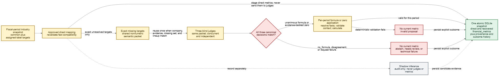

# MS3 — Base Metric Mapping and Recovery

## Status

`active`

This plan contains the mapping and recovery portion of the approved former
Plan 203 design. The split from ingestion is organizational only. MS2 supplies
the complete evidence snapshot; MS3 completes the same atomic company-refresh
workflow.

### Current implementation coverage

Implemented seams include precedence-selected direct mapping, exact missing
targets, shadow candidate persistence, nonnumeric semantic packets,
evidence-group reuse, three blind judge adapters, canonical unanimity, and
immutable group recommendation history. Period-specific deterministic
formula/zero application, immutable recovery-application persistence, and
recovered `financial_metrics` with explicit origin/provenance are also
implemented. The atomic versioned company metric publication seam, stale-value
audit history, target isolation, and rollback behavior are implemented.
Incremental annual workflow integration and the complete real-company proof
remain unfinished. `docs/structure.md` is authoritative for current behavior.

## Purpose and Deliverable

Convert MS2's trustworthy annual evidence snapshot into the system's existing
target metrics. Apply approved direct mappings first, identify exact still-
missing targets, request formula/zero judgments from three independent models,
validate each unanimous recommendation numerically for every period, and
publish direct/recovered current metrics with complete provenance.

The pipeline ends after current base metric observations are published in
`financial_metrics`. Indicators, RAG, financial analysis, and answer generation
are downstream milestones.

## Diagram



Editable sources: [Mermaid](../diagrams/MS3-mapping.mmd) and
[Excalidraw](../diagrams/MS3-mapping.excalidraw).

## Dependencies and Authoritative References

- [MS2](MS2-annual-xbrl-ingestion.md): selected observations, structural
  evidence, validation, precedence, and fiscal-period labels
- `docs/policies/mapping.md`: durable mapping governance
- `CONTEXT.md`: canonical metric and recovery terminology
- `docs/structure.md`: current implementation truth
- `src/analyze/prompts.py`: required location for every judge prompt

## Scope

- Period target selection from common and approved industry bundles
- Source-controlled and approved direct mapping
- Minimal target-compatibility revalidation
- Shadow-only deterministic inferred candidates
- Exact still-missing target calculation
- Versioned nonnumeric semantic evidence packets
- Three concurrent blind judge calls and canonical unanimity
- Addition/subtraction formula and affirmative-zero decisions
- Deterministic period application with source lineage
- Group-level recommendation and period-level application persistence
- Direct/recovered current metric publication or explicit failure
- Incremental affected-period remapping and recommendation reuse
- One atomic company snapshot

## Non-Goals

- Filing discovery, acquisition, Arelle execution, or source reconciliation
- 10-Q/10-Q-A structured mapping
- Production activation of deterministic inferred mappings
- Automatic approval of a one-concept recovery as a reusable direct mapping
- Majority voting
- Numeric values in semantic judge prompts
- Multiplication, division, ratios, percentages, or arbitrary constants in
  recovery formulas
- Prompt-change-driven retroactive rejudging
- Indicators, retrieval, RAG, financial analysis, or API work

## Accepted Decisions and Invariants

1. Mapping starts only after MS2 completes every applicable accession attempt
   and latest-valid selection.
2. Existing source-controlled and human-approved mappings run before any LLM
   recovery.
3. Successfully direct-mapped targets never enter recovery, although their raw
   concepts may be formula components for another missing target.
4. Deterministic inferred mappings remain inspectable shadow records and cannot
   populate `financial_metrics`, remove a missing target, or influence judges.
5. Recovery applies only to exact still-missing target metrics.
6. The judges are `gpt-5-mini`, `gemini-3.1-flash-lite`, and
   `gemini-2.5-flash`.
7. All three receive the same nonnumeric semantic packet, run independently,
   and are blind to one another.
8. Only exact canonical unanimity can pass. There is no majority rule.
9. Formula recovery uses reported concepts with addition/subtraction only.
10. Semantic judgment may be shared only across periods with identical visible
    evidence, exact missing targets, company, and judge lineup.
11. Numeric validation and calculation always run separately per period.
12. Absence is not evidence of zero; zero requires unanimous judgment plus
    affirmative deterministic evidence.
13. Direct and recovered current observations coexist in `financial_metrics`
    with distinct provenance.
14. A failed target does not invalidate unrelated successful ingestion,
    mappings, or recoveries.
15. Consumers never observe a partial mixture of old and new company state.
16. Lower recovery recall is acceptable; abstention and explicit missing
    metrics are correct outcomes.

## Responsibility Boundary

| Responsibility | Owner |
| --- | --- |
| Evidence snapshot and source precedence | MS2 |
| Fixed metric ontology and candidate targets | Mapping catalog |
| Direct mapping and compatibility checks | Processing layer |
| Shadow candidate generation | Processing layer |
| Semantic packet construction | Processing layer |
| Judge prompt templates and provider calls | Analyze layer |
| Canonical comparison and period validation | Processing/workflow layers |
| Mapping, recommendation, application, and metric records | Storage repositories |
| Atomic company publication | Thin workflow/orchestration layer |

## Canonical Workflow

```text
complete MS2 evidence snapshot
  -> target set for each annual accounting context
  -> source-controlled direct mappings
  -> active human-approved direct mappings
  -> compatible prior approved mappings after revalidation
  -> persist shadow deterministic candidates
  -> calculate exact still-missing targets
  -> build deterministic nonnumeric semantic packet
  -> group periods with identical visible evidence and model lineup
  -> run three blind judges concurrently or reuse exact stored outcome
  -> require exact canonical formula/zero unanimity
  -> resolve and validate components independently for every period
  -> calculate formula or affirm zero
  -> stage direct metrics, recoveries, provenance, and failures
  -> commit one atomic company snapshot
```

Arelle supplies structural/validation evidence but never assigns a project
metric name.

## Target Set and Direct Mapping

For one fiscal period:

```text
common base targets
  + every target bundle for that period's approved industry labels
  -> deduplicated target set
```

Later industry labels never change earlier target sets. If MS2 records an empty
label snapshot, use common targets only.

A direct mapping may use a precedence-selected Arelle or Company Facts
observation. Preserve the raw observation ID and complete source lineage.
Before a known mapping populates a target, require:

- numeric value
- compatible instant/duration period type
- compatible basic unit family, such as currency versus shares
- usable consolidation/dimensional context
- no blocking diagnostic on the selected observation

These rules reject impossible uses; they do not discover or approve mappings.
Fine-grained compatibility frameworks remain deferred until observed failures
justify them.

## Shadow Deterministic Inference

After hard/approved mapping, project code may score one-concept alternatives
from semantic evidence. Initial behavior remains shadow-only:

- persist candidates and evidence for inspection
- never create a current metric
- never count a target as covered
- never expose candidate scores/evidence to judges
- do not select an activation threshold in advance

Any future activation requires a separately approved evaluation based on
observed results. Former fixed company/decision counts are not governing gates.

## Missing Targets and Current Statement Evidence

A target becomes missing only after all eligible direct mappings for its
accounting context run. Build accession-aware statement evidence using
statement-network and fact-level latest-valid precedence. Preserve the source
accession for every fact, relationship, and metadata field.

Valid components may come from different accessions when their accounting
context is compatible. Prioritize the applicable statement's latest valid
evidence. A cross-statement component requires an accounting rationale.

A concept is executable only when the period has one usable precedence-selected
source fact. Mapped and unmapped concepts may both be formula components.
Relationship-connected concepts without a usable fact may appear as explicit
context-only evidence but cannot be selected.

## Judge Packet

Build one compact, deterministic, versioned, nonnumeric packet containing:

- exact missing-target set
- target definitions and primary statements
- eligible concept identifiers
- labels/documentation with field-level source attribution
- presentation hierarchy and roles
- calculation edges and weights
- definition/dimensional relationships
- available Formula rules and assertion outcomes
- validation diagnostics and availability/blocking markers
- focused target/statement neighborhoods
- stable evidence IDs tied to persisted or cached MS2 evidence

Prioritize US-GAAP and SEC concepts while retaining relevant issuer extensions.
Do not invent metadata. Exclude numeric values, raw fact IDs, dates, units,
accessions, fiscal labels, and shadow scores from judge-visible content and its
semantic grouping hash. Provider-specific packet variants are prohibited.

## Three-Judge Recovery

Run these three blind independent judges concurrently for a new recommendation
group:

- OpenAI `gpt-5-mini`
- Gemini `gemini-3.1-flash-lite`
- Gemini `gemini-2.5-flash`

The lineup does not currently require three different providers. Every prompt
template belongs in `src/analyze/prompts.py` and must require cited evidence,
forbid unsupported causal claims, and separate semantic judgment from numeric
validation.

Each judge returns one structured decision per target:

```text
target
decision: formula | zero | no_formula
components and + / - operators when applicable
cited evidence IDs
short accounting rationale
```

Free-form-only or numeric answers are invalid.

Canonical comparison:

- use exact concept identifiers and operators
- ignore prose and confidence
- normalize harmless commutative addition order
- treat any changed component/operator as a different formula

Outcomes:

| Responses/application | Outcome |
| --- | --- |
| Three identical formulas | Eligible for deterministic application |
| Three identical zero decisions | Eligible for affirmative-zero application |
| Three `no_formula` decisions | Unanimous abstention; no metric |
| Successful disagreement | `needs_review`; no metric |
| Missing/malformed/failed provider result | `technical_failure`; no metric |
| Unanimous result fails period validation | `invalid_proposal`; no metric |

## Semantic Recommendation Groups and Reuse

Periods share one recommendation only when company, statement evidence,
eligible semantic concept pool, exact missing-target set, and normalized
three-model lineup are identical. Numeric values, units, dates, fiscal labels,
accessions, and raw fact IDs never affect grouping.

Run judges once per group and apply the outcome independently to every period.
A later refresh may reuse the record for a new period when its visible evidence,
targets, and lineup match. A changed lineup requires new judgment for the new
period and never retroactively rejudges historical periods. Prompt-change
rejudging is deferred.

Technical-failure retries are explicit. Preserve the failed immutable attempt
and append a later attempt rather than rewriting history.

## Deterministic Formula and Zero Application

Formula patterns contain only eligible reported concepts and `+`/`-`. A
one-concept recovery remains context-specific and never becomes a reusable
approved mapping automatically.

For every period:

- resolve each component to one usable precedence-selected source fact
- reject blocking fact diagnostics
- require compatible company/entity, actual period, and
  dimensions/consolidation state
- require unit compatibility
- evaluate only the unanimously approved expression
- preserve component raw IDs, sources, accessions, and diagnostics

The judges never receive these numeric values. One period may fail while
another in the same semantic group succeeds.

Zero requires both unanimous judgment and affirmative Arelle-backed evidence
that the target is zero for that accounting context. Absence alone leaves the
target missing.

A successful formula/zero application produces a calculated recovery in
`financial_metrics`, not a reported fact. Direct metrics link to selected raw
observations; recovered metrics link to period-specific applications. Both
retain complete lineage.

## Persistence Contract

Persist separate logical records for:

1. A group-level semantic recommendation containing the evidence packet, model
   lineup, all three structured responses, canonical outcome, and timestamps.
2. A period-specific recovery application containing resolved source facts,
   accounting context, deterministic validation, calculated value, and failure.

One group record may have many period applications. A recovered current metric
points to its successful application; do not copy the full judge record into
each period.

Keep direct and recovered values in `financial_metrics` with explicit origin
and provenance. Persist shadow candidates, needs-review, abstention,
invalid-proposal, and technical-failure outcomes separately from current
metrics and approved mappings.

MS3 uses the MS2 annual-only migration:

- annual selection ignores legacy `is_active_window`
- general form fields remain for future compatibility
- shared active-window columns remain temporarily for current indicator and
  retrieval consumers
- removing those shared fields requires a later cross-consumer decision

## Atomic Company Publication

Stage acquisition results, precedence, mappings, judge outcomes, applications,
and failures before publication. Commit related current state in one SQLite
transaction.

The snapshot may contain complete/failed accessions, selected observations,
direct mappings, shadow candidates, recovered metrics, explicit failure
targets, processor/model/evidence versions, and completion time.

- A SQLite write failure rolls back publication.
- One target's failure does not remove unrelated successful work.
- Consumers never see a mixed old/new snapshot.
- If changed evidence invalidates a current mapping/recovery and replacement
  fails, retain the old result only in audit history and publish the target as
  missing with its failure reason.
- Never silently serve a stale metric as current.
- Do not recompute indicators inside MS3.

## Incremental Refresh

After MS2 processes new or amended evidence:

1. Recompute reconciliation and precedence.
2. Identify periods whose selected facts or semantic evidence changed.
3. Re-run direct mapping only for affected periods.
4. Preserve unchanged historical mapping/recovery records.
5. When only numeric values changed, reuse the semantic formula and rerun period
   application.
6. Call judges again only when concepts, visible evidence, exact missing
   targets, or lineup changed.

Earlier fiscal-period industry labels remain immutable.

## Deadline and Failure Behavior

The measured company deadline covers MS2 acquisition/Arelle work plus
classification, direct mapping, judge calls, application, and persistence.
Former fixed warm/initial deadlines are provisional until representative
full-history measurement.

When the deadline expires, stop new expensive work, retain completed staged
work, record failures for unfinished targets/accessions, and publish only an
internally consistent snapshot. A deadline never permits a stale metric to
remain current.

| Failure | Required behavior |
| --- | --- |
| Direct compatibility failure | Candidate does not map |
| Shadow uncertainty | Preserve shadow record only |
| Judge disagreement | `needs_review`; no recovered metric |
| Unanimous `no_formula` | Abstention; no recovered metric |
| Provider/request failure | `technical_failure`; no metric for target |
| Unanimous decision fails application | `invalid_proposal`; no metric |
| Publication failure | Roll back the snapshot transaction |

MS2 evidence failures follow the MS2 plan and may use labeled Company Facts
fallback. Do not fabricate Arelle evidence for the judges.

## Verification and Acceptance

Focused automated coverage must prove:

- period target union and historical-label isolation
- approved direct mapping plus all minimal compatibility rejections
- shadow isolation from missing-target and judge interfaces
- exact missing targets after direct mapping
- packet contents, exclusions, eligibility, and evidence availability
- exact group boundaries and recommendation reuse
- three concurrent identical blind requests
- canonical formula/zero unanimity, abstention, disagreement, invalid output,
  technical failure, explicit retry, and immutable history
- deterministic application, including compatible mixed-accession components
- group/application provenance separation
- recovered current metric origin/lineage
- stale-current removal and transaction rollback
- no-change refresh with no judge calls

The combined MS2/MS3 proof run processes one company's complete selected annual
history and saves an evidence-first report containing:

- selected/reused/failed accessions and Arelle summaries
- reconciliation, duplicate, and precedence evidence
- period industry snapshots
- direct coverage and shadow candidates
- exact missing targets and semantic groups
- model calls/cache use, canonical outcomes, and evidence citations
- period application successes/failures and current metric provenance
- total timing and storage/cache growth

The report must expose failures rather than predeclare success.

MS3 is completed only when direct metrics remain correct, only exact missing
targets reach identical judge packets, only unanimous canonical decisions can
produce recovered metrics, every recovery has successful period application
and full provenance, failures produce no current metric, stale metrics cannot
remain current, atomic rollback is proven, and the real-company report agrees
with governing documentation.

## Deferred Decisions

- Production activation of deterministic inferred mappings
- Fixed calibration/holdout sizes
- Prompt-change-driven historical rejudging
- Formula operators beyond addition/subtraction
- Indicators, analysis, retrieval, and RAG integration

## Assumptions

- The system metric catalog remains project-owned.
- Existing source-controlled and human-approved mappings remain authoritative.
- SQLite remains the authoritative domain store.
- MS2 supplies complete, versioned, source-attributed evidence.
- Abstention and explicit missing metrics are acceptable production outcomes.
